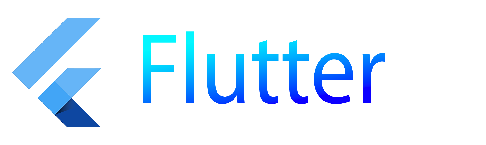
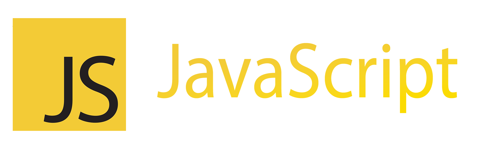
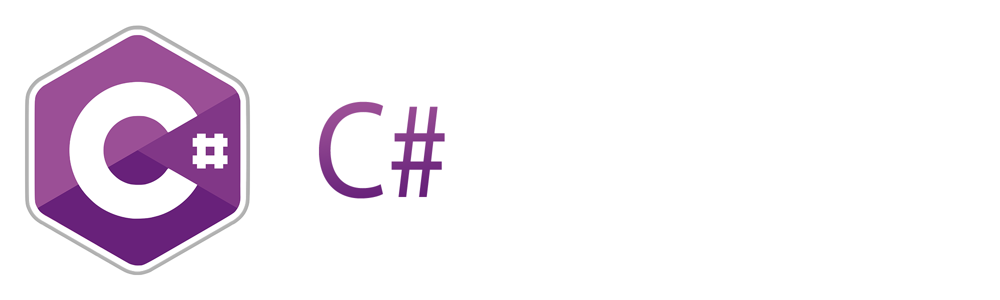
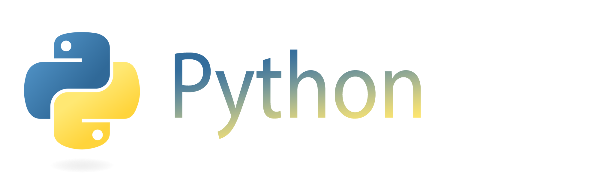

* <a href="https://github.com/sudlenia/Tip-Calculation-App">Tip Calculator</a>
* <a href="https://github.com/sudlenia/Tip-Calculation-App">Aspirity Flutter Internship</a>
* <a href="https://github.com/sudlenia/Tip-Calculation-App">ToDoList w/ Achievements and Time-Tracker</a>

* <a href="https://github.com/sudlenia/Vue-ToDoList">ToDoList</a>

* <a href="https://github.com/sudlenia/Frontend-Project">Frontend Study Project</a>

* <a href="https://github.com/sudlenia/GooseGameRogueLike">Goose Game Rogue Like</a>
* <a href="https://github.com/sudlenia/WinForms-WPF-Apps">WinForm and WPF Apps</a>

* <a href="https://github.com/sudlenia/Backend-Flask-Django-Study">Flask and Django Study Projects</a>

<!--
- 🔭 I’m currently working on ...
- 🌱 I’m currently learning ...
- 👯 I’m looking to collaborate on ...
- 🤔 I’m looking for help with ...
- 💬 Ask me about ...
- 📫 How to reach me: ...
- 😄 Pronouns: ...
- ⚡ Fun fact: ...
-->
